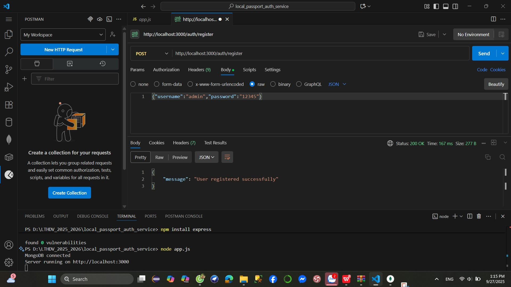
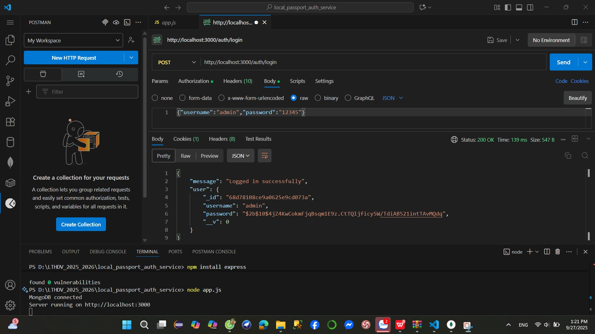
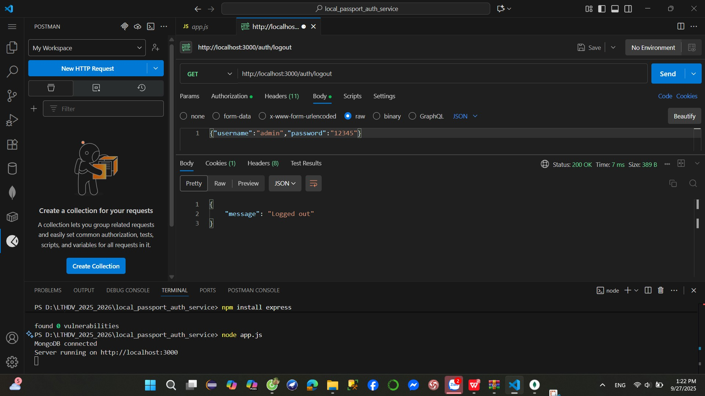

# Local Passport Authentication Service

This project demonstrates authentication in Node.js using Passport.js (Local Strategy) with MongoDB and Express sessions.

## 1. Run Server

Install dependencies:

npm install

Run server:

node app.js

Server will run on:
👉 http://localhost:3000

## 2. API Testing with Postman

We use Postman to test all APIs.
Passport.js manages authentication, and express-session automatically sets a session cookie (connect.sid) upon successful login.

# a. Register a new user

Endpoint: POST /auth/register

Body (JSON):

{
  "username": "admin",
  "password": "12345"
}

Expected result:

{
  "message": "User registered successfully"
}

📷 Result file public/img/register.img

# b. Login

Endpoint: POST /auth/login

Body (JSON):

{
  "username": "admin",
  "password": "12345"
}

Expected result:

{
  "message": "Logged in successfully",
  "user": {
    "_id": "...",
    "username": "admin",
    "password": "hashed..."
  }
}

👉 A session cookie (connect.sid) is now stored in Postman and MongoDB.

. Logout 
